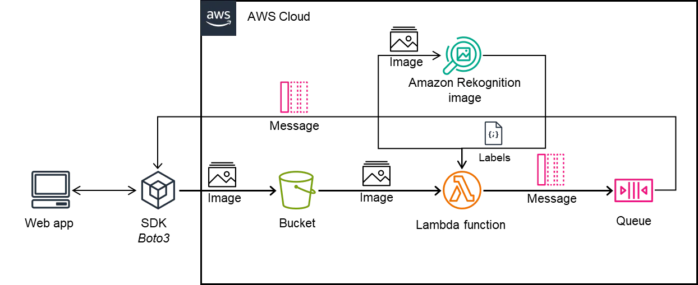

# 🖼️ AI-Powered Image Analysis Application

A serverless image analysis application that leverages **AWS Rekognition** to automatically detect and label objects in uploaded images. Built with **Flask** and powered by AWS cloud services.



---

## 📋 Table of Contents

- [Overview](#overview)
- [Architecture](#architecture)
- [Features](#features)
- [AWS Services Used](#aws-services-used)
- [Prerequisites](#prerequisites)
- [Installation](#installation)
- [Configuration](#configuration)
- [AWS Setup Guide](#aws-setup-guide)
- [Usage](#usage)
- [API Endpoints](#api-endpoints)
- [Lambda Functions](#lambda-functions)
- [Example Output](#example-output)
- [Project Structure](#project-structure)
- [Troubleshooting](#troubleshooting)
- [Contributing](#contributing)
- [License](#license)

---

## 🎯 Overview

This application provides an end-to-end solution for automated image analysis using artificial intelligence. Users can upload images through a simple web interface, and the system automatically:

1. Stores images securely in AWS S3
2. Triggers serverless image processing via AWS Lambda
3. Analyzes images using AWS Rekognition AI
4. Delivers results through an asynchronous message queue
5. Displays detected labels with confidence scores

---

## 🏗️ Architecture

```
┌─────────────────────────────────────────────────────────────────────────────────┐
│                              APPLICATION WORKFLOW                                │
└─────────────────────────────────────────────────────────────────────────────────┘

    ┌──────────────┐          ┌──────────────┐          ┌──────────────────────┐
    │              │  Upload  │              │  Trigger │                      │
    │  Flask App   │─────────▶│   AWS S3     │─────────▶│    AWS Lambda        │
    │  (Frontend)  │          │   Bucket     │          │    Function          │
    │              │          │              │          │                      │
    └──────────────┘          └──────────────┘          └──────────┬───────────┘
           │                                                       │
           │                                                       │ Analyze
           │                                                       ▼
           │                                            ┌──────────────────────┐
           │                                            │                      │
           │                                            │  AWS Rekognition     │
           │                                            │  (AI/ML Service)     │
           │                                            │                      │
           │                                            └──────────┬───────────┘
           │                                                       │
           │                                                       │ Results
           │                                                       ▼
           │         Retrieve        ┌──────────────────────────────────────────┐
           │◀────────────────────────│              AWS SQS Queue               │
           │                         │          (Message Delivery)              │
           │                         └──────────────────────────────────────────┘
           ▼
    ┌──────────────┐
    │   Display    │
    │   Results    │
    └──────────────┘
```

---

## ✨ Features

| Feature | Description |
|---------|-------------|
| 🤖 **AI-Powered Analysis** | Uses AWS Rekognition for accurate object detection |
| ☁️ **Serverless Architecture** | No servers to manage; auto-scaling with AWS Lambda |
| 🔄 **Asynchronous Processing** | SQS decouples upload from result retrieval |
| 🎯 **High Confidence Filtering** | Only returns labels with ≥98% confidence |
| 🔒 **Secure File Handling** | Sanitizes filenames to prevent security vulnerabilities |
| 📊 **JSON Results** | Clean, structured output for easy integration |
| 🌐 **Web Interface** | Simple, user-friendly upload interface |

---

## 🛠️ AWS Services Used

| Service | Purpose | Role in Application |
|---------|---------|---------------------|
| **Amazon S3** | Object Storage | Stores uploaded images securely |
| **AWS Lambda** | Serverless Compute | Runs image analysis code on-demand |
| **Amazon Rekognition** | AI/ML Service | Detects and labels objects in images |
| **Amazon SQS** | Message Queue | Delivers analysis results asynchronously |

---

## 📦 Prerequisites

Before you begin, ensure you have the following:

- **Python 3.8+** installed
- **AWS Account** with appropriate permissions
- **AWS CLI** configured (optional but recommended)
- **pip** package manager

### Required AWS Permissions

Your AWS IAM user/role needs the following permissions:

```json
{
    "Version": "2012-10-17",
    "Statement": [
        {
            "Effect": "Allow",
            "Action": [
                "s3:PutObject",
                "s3:GetObject",
                "s3:ListBucket"
            ],
            "Resource": [
                "arn:aws:s3:::your-bucket-name",
                "arn:aws:s3:::your-bucket-name/*"
            ]
        },
        {
            "Effect": "Allow",
            "Action": [
                "sqs:SendMessage",
                "sqs:ReceiveMessage",
                "sqs:DeleteMessage",
                "sqs:GetQueueAttributes"
            ],
            "Resource": "arn:aws:sqs:us-east-1:*:your-queue-name"
        },
        {
            "Effect": "Allow",
            "Action": [
                "rekognition:DetectLabels"
            ],
            "Resource": "*"
        }
    ]
}
```

---

## 🚀 Installation

### 1. Clone the Repository

```bash
git clone https://github.com/yourusername/AI-Powered-Image-Analysis-Application.git
cd AI-Powered-Image-Analysis-Application
```

### 2. Create Virtual Environment

```bash
# Windows
python -m venv venv
venv\Scripts\activate

# macOS/Linux
python3 -m venv venv
source venv/bin/activate
```

### 3. Install Dependencies

```bash
pip install flask boto3 python-dotenv
```

Or create a `requirements.txt`:

```txt
flask>=2.0.0
boto3>=1.26.0
python-dotenv>=1.0.0
```

Then install:

```bash
pip install -r requirements.txt
```

---

## ⚙️ Configuration

### 1. Create Environment File

Create a `.env` file in the project root:

```env
# AWS S3 Configuration
BUCKET_NAME=your-s3-bucket-name

# AWS SQS Configuration
SQS_QUEUE_URL=https://sqs.us-east-1.amazonaws.com/123456789012/your-queue-name

# AWS Credentials
AWS_ACCESS_KEY_ID=your-access-key-id
AWS_SECRET_ACCESS_KEY=your-secret-access-key
```

### 2. AWS Profile Configuration

The application uses an AWS profile named `Hyperprofile`. Configure it in `~/.aws/credentials`:

```ini
[Hyperprofile]
aws_access_key_id = your-access-key-id
aws_secret_access_key = your-secret-access-key
region = us-east-1
```

> **Note:** You can modify the profile name in `app.py` if needed.

---

## 🔧 AWS Setup Guide

### Step 1: Create S3 Bucket

1. Go to **AWS Console** → **S3**
2. Click **Create bucket**
3. Enter a unique bucket name
4. Select region: `us-east-1`
5. Keep other settings as default
6. Click **Create bucket**

### Step 2: Create SQS Queue

1. Go to **AWS Console** → **SQS**
2. Click **Create queue**
3. Select **Standard** queue type
4. Enter queue name
5. Click **Create queue**
6. Copy the **Queue URL** for your `.env` file

### Step 3: Create Lambda Function

1. Go to **AWS Console** → **Lambda**
2. Click **Create function**
3. Choose **Author from scratch**
4. Enter function name: `ImageAnalysisFunction`
5. Runtime: **Python 3.9** or higher
6. Click **Create function**
7. Copy the code from `updated_lambda_function.py`
8. Update the `queue_url` variable with your SQS Queue URL
9. Click **Deploy**

### Step 4: Configure S3 Trigger

1. In your Lambda function, click **Add trigger**
2. Select **S3**
3. Choose your bucket
4. Event type: **All object create events**
5. Click **Add**

### Step 5: Set Lambda Permissions

Attach the following policy to your Lambda execution role:

- `AmazonRekognitionReadOnlyAccess`
- `AmazonS3ReadOnlyAccess`
- `AmazonSQSFullAccess`

---

## 🎮 Usage

### Starting the Application

```bash
python app.py
```

The application will start at `http://127.0.0.1:5000`

### Uploading an Image

1. Open your browser and navigate to `http://localhost:5000`
2. Click **Choose File** and select an image (PNG, JPG, or JPEG)
3. Click **Upload**
4. Wait for the success message

### Retrieving Results

1. Click **Retrieve** button on the home page
2. The application polls the SQS queue for results
3. Analysis results are displayed in JSON format

---

## 📡 API Endpoints

| Endpoint | Method | Description |
|----------|--------|-------------|
| `/` | GET | Home page with upload form |
| `/upload` | POST | Upload image to S3 |
| `/retrieve` | GET | Retrieve analysis results from SQS |

### Upload Endpoint Details

**Request:**
- Content-Type: `multipart/form-data`
- Body: `file` - The image file to upload

**Response:**
- `200 OK`: File uploaded successfully
- `500 Error`: Upload failed

### Retrieve Endpoint Details

**Response:**
- `200 OK`: Returns JSON with analysis results
- `404 Not Found`: No results available

---

## ⚡ Lambda Functions

### `lambda_function.py` (Basic Version)

- Processes S3 events
- Calls AWS Rekognition
- Logs results to **CloudWatch** only
- Best for: Development and debugging

### `updated_lambda_function.py` (Production Version)

- Processes S3 events
- Calls AWS Rekognition
- Sends results to **SQS Queue**
- Logs to CloudWatch
- Best for: Production deployment

**Key Differences:**

| Feature | Basic | Production |
|---------|-------|------------|
| CloudWatch Logging | ✅ | ✅ |
| SQS Integration | ❌ | ✅ |
| Flask App Compatible | ❌ | ✅ |

---

## 📊 Example Output

### Successful Analysis

When analyzing an image of a landscape, you might receive:

```json
{
  "file_name": "mountain_view.jpg",
  "labels": [
    {
      "Name": "Mountain",
      "Confidence": 99.87
    },
    {
      "Name": "Nature",
      "Confidence": 99.54
    },
    {
      "Name": "Outdoors",
      "Confidence": 98.92
    },
    {
      "Name": "Scenery",
      "Confidence": 98.45
    }
  ]
}
```

### Supported Image Types

| Format | Extension | Supported |
|--------|-----------|-----------|
| JPEG | `.jpg`, `.jpeg` | ✅ |
| PNG | `.png` | ✅ |
| GIF | `.gif` | ❌ |
| WebP | `.webp` | ❌ |

---

## 📁 Project Structure

```
AI-Powered-Image-Analysis-Application/
│
├── app.py                      # Flask web application
├── lambda_function.py          # Basic Lambda function (CloudWatch only)
├── updated_lambda_function.py  # Production Lambda function (SQS integration)
├── aws.webp                    # AWS architecture diagram
├── .env                        # Environment variables (create this)
├── .gitignore                  # Git ignore rules
└── README.md                   # This file
```

---

## 🔍 Troubleshooting

### Common Issues

#### 1. "Invalid S3 bucket name" Error

**Cause:** `BUCKET_NAME` environment variable is not set or invalid.

**Solution:**
```bash
# Verify your .env file has:
BUCKET_NAME=your-valid-bucket-name
```

#### 2. "Failed to upload file to S3" Error

**Cause:** AWS credentials are incorrect or lack permissions.

**Solution:**
- Verify AWS credentials in `.env`
- Check IAM permissions for S3 access
- Ensure bucket exists in `us-east-1` region

#### 3. "Analysis results not found" Error

**Cause:** Lambda function hasn't processed the image or SQS message not available.

**Solution:**
- Wait a few seconds and try again
- Check Lambda function logs in CloudWatch
- Verify S3 trigger is configured correctly

#### 4. No Labels Returned

**Cause:** No objects detected with ≥98% confidence.

**Solution:**
- Upload a clearer image
- Modify the confidence threshold in Lambda function (line 68):
  ```python
  for label in labels if label['Confidence'] >= 90.0  # Lower threshold
  ```

### Checking AWS Logs

```bash
# View Lambda logs
aws logs tail /aws/lambda/ImageAnalysisFunction --follow

# Check SQS queue messages
aws sqs get-queue-attributes \
    --queue-url YOUR_QUEUE_URL \
    --attribute-names ApproximateNumberOfMessages
```

---

## 🤝 Contributing

Contributions are welcome! Please follow these steps:

1. Fork the repository
2. Create a feature branch (`git checkout -b feature/AmazingFeature`)
3. Commit your changes (`git commit -m 'Add some AmazingFeature'`)
4. Push to the branch (`git push origin feature/AmazingFeature`)
5. Open a Pull Request

---

## 📄 License

This project is personal learing project.

---

## 🙏 Acknowledgments

- [AWS Rekognition](https://aws.amazon.com/rekognition/) for powerful image analysis
- [Flask](https://flask.palletsprojects.com/) for the web framework
- [Boto3](https://boto3.amazonaws.com/v1/documentation/api/latest/index.html) for AWS SDK

---

<p align="center">
  Made with ❤️ using AWS Cloud Services
</p>
